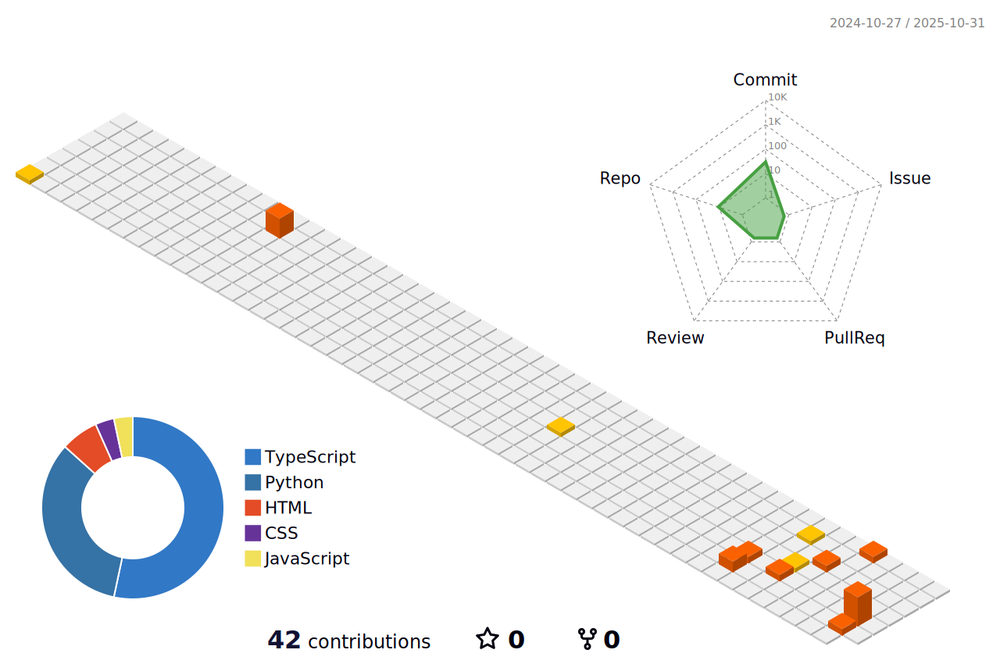

# Hello World! 

```
   ____     __  __               __  __  __ 
  / __/__ _/ /_/ /  ___ _____  / /_/ / / /
 / _// _ `/ __/ _ \/ _ `/ __/ /  _/ /_/ / 
/___/\_,_/\__/_//_/\_,_/\__/  \__/\____/  
```

[](https://git.io/typing-svg)

<p align="center">
    
    <a href="https://github.com/vo-hoang-kh4ng?tab=followers">
        
    </a>
    <a href="https://github.com/vo-hoang-kh4ng?tab=stars">
        
    </a>
</p>

<p align="center">
    <b>I'm an AI Engineer passionate about building intelligent systems and LLM applications</b>
</p>

---

### 🛠️ Languages & Tools:

<p align="center">
  
  
  
  
  
  
  
</p>

### 📊 GitHub Stats:

<p align="center">
  
  
  
</p>

### 🏆 GitHub Profile Trophy:


[](https://git.io/streak-stats)
<p align="center">
  
</p>

### 📈 Contribution Metrics:

<p align="center">
  
</p>

### ⚡ Recent Activity:

<!--RECENT_ACTIVITY:start-->
<!--RECENT_ACTIVITY:end-->

### ⏱ Development Stats:
<!--START_SECTION:waka-->
<!--END_SECTION:waka-->

### 🐍 Contribution Snake:

<p align="center">
  <picture>
    <source media="(prefers-color-scheme: dark)" srcset="dist/github-snake-dark.svg" />
    <source media="(prefers-color-scheme: light)" srcset="dist/github-snake.svg" />
    
  </picture>
</p>

### 🗺️ Contribution Graph:

<p align="center">
  
</p>

---

<p align="center">
  <i>Let's connect and chat! Open to collaborating on interesting projects.</i>
</p>

<p align="center">
  <a href="https://github.com/vo-hoang-kh4ng" target="_blank">
    
  </a>
  <a href="https://linkedin.com/in/vo-hoang-kh4ng" target="_blank">
    
  </a>
  <a href="https://twitter.com/vo_hoang_kh4ng" target="_blank">
    
  </a>
  <a href="https://dev.to/vo_hoang_kh4ng" target="_blank">
    
  </a>
  <a href="https://medium.com/@vo_hoang_kh4ng" target="_blank">
    
  </a>
  <a href="https://hashnode.com/@vo_hoang_kh4ng" target="_blank">
    
  </a>
  <a href="mailto:vo.hoang.kh4ng@gmail.com">
    
  </a>
</p>

<p align="center">
  <a href="https://www.buymeacoffee.com/vo_hoang_kh4ng" target="_blank">
    
  </a>
</p>
